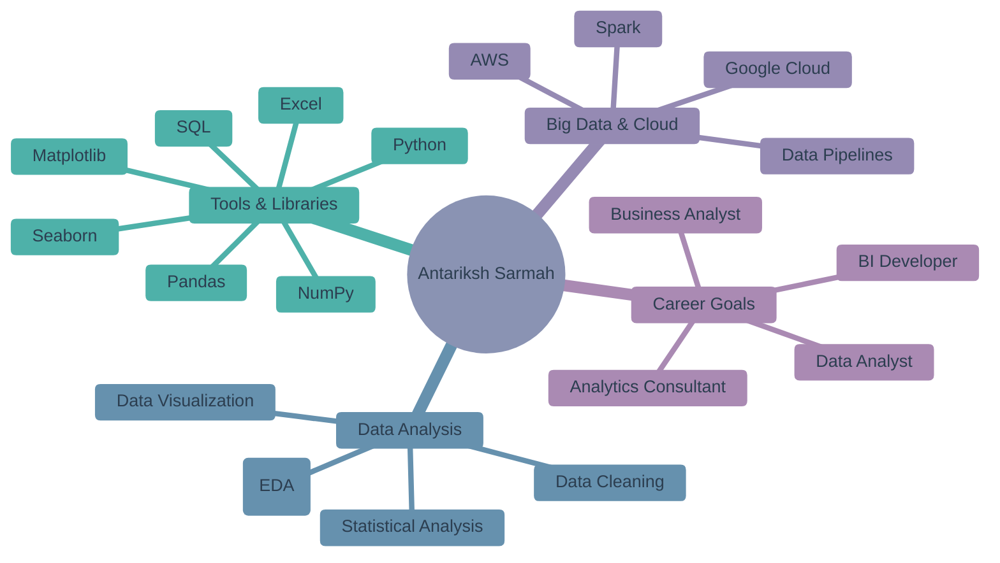

# 🚀Antariksh Sarmah | Data Analyst

---

<!-- LANGUAGES & TOOLS -->
<h1 align="center">🛠 Language & Tools</h1>

 

<!-- DATA & ANALYTICS -->

### ⚙️📊 ETL & Data Analytics

  &nbsp;&nbsp;
  
  &nbsp;&nbsp;
  
  &nbsp;&nbsp;
  
  &nbsp;&nbsp;
  
  &nbsp;&nbsp;
  
  &nbsp;&nbsp;
  

 

<!-- BI & VISUALIZATION -->

### 📈 Business Intelligence & Visualization

 
  &nbsp;&nbsp;&nbsp;
  <a href="https://powerbi.microsoft.com/" target="_blank" title="Power BI">
    

 

<!-- DATABASES -->

### ☁🗄 Cloud & Databases

  
  &nbsp;&nbsp;&nbsp;
  
  &nbsp;&nbsp;&nbsp;
  

 

<!-- FOOTER -->

  

    💡 Click on any icon to explore the technology
  

# 📊 GitHub Performance Metrics

<table>
<tr>
<td width="50%" align="center">

</td>
<td width="50%" align="center">

</td>
</tr>
</table>

<table>
<tr>
<td width="50%" align="center">

</td>
<td width="50%" align="center">

</td>
</tr>
</table>

---
## 🎯 Current Focus

 
 

---
 

## 📜 Certifications

<table>
<tr>
<td align="center" width="33%">

 
<b>Alteryx Designer Core Certification</b>
  
<a href="https://drive.google.com/file/d/1AA3e94CMHWPhfuac8Sp_ns-BevF-OmI6/view?usp=sharing">View Certificate →</a>
  
<a href="https://www.credly.com/earner/earned/badge/4daf4424-d826-41e4-9881-92ad7357b7e7">Verify through Credly →</a>
</td>

<td align="center" width="33%">

 
<b>Alteryx Foundational Micro-Credential</b>
  
<a href="https://drive.google.com/file/d/1gL7qofINBfTGMIz-LYqnsSL2jRrGRCQm/view?usp=sharing">View Certificate →</a>
  
<a href="https://www.credly.com/earner/earned/badge/b5b154cf-2d5b-46c4-8abf-22b45d1f99f1">Verify through Credly →</a>
</td>

<td align="center" width="33%">

 
<b>GitHub Copilot</b>
 Certification Program
  
<a href="https://drive.google.com/file/d/1JN66PZdAs7tN6nSWMBUvpWCo2AJJM8Rp/view?usp=sharing">View Certificate →</a>
      
<a href="https://learn.microsoft.com/api/credentials/share/en-us/ANTARIKSHSARMAH-6871/E714D5F7AC8D7DA2?sharingId=A9660970C4CB7212">Verify through Microsoft Learn →</a>
</td>
</tr>

<tr>
<td align="center" width="33%">

 
<b>Oracle Cloud Infrastructure 2025</b>
 Certified AI Foundations Associate
  
<a href="https://drive.google.com/file/d/1Ap9UFZgzqvSS6hE2n_maXjdyDjjz3_ah/view?usp=sharing">View Certificate →</a>
  
<a href="https://catalog-education.oracle.com/ords/certview/sharebadge?id=15616F0246BFDBF1E6E23B58928F997D437C93D6D0C37BCF711BBDD5F2EA0D46">Verify through Oracle Certview →</a>
</td>
    
<td align="center" width="33%">

 
<b>MongoDB Certified Associate Data Modeler</b>
  
<a href="https://drive.google.com/file/d/1AXAbYvdYhvmxT7lzqLWdpX5ZzmjHfFmR/view?usp=sharing">View Certificate →</a>
      
<a href="https://www.credly.com/go/09L89M2P">Verify through Credly →</a>
</td>
</tr>
    
</table>

 

---

 

# 💼 Professional Experience

<table>
<tr>
<td>

**Data Analyst @ ALA Pvt Ltd**  
***Aug 2025 - Jan 2026***

- Performed ETL & automation workflows using SQL, Python & Alteryx  
- Designed dashboards using Power BI to improve data visibility  
- Cleaned, transformed, and validated 50K+ records across systems  
- Automated Excel & reporting workflows (30% reduction in manual work)

</td>
</tr>
</table>

---

# 💼 Open to Opportunities

### 🎯 **Actively Looking For Roles In**

<table>
<tr>
<td align="center" width="33%">

 <b>Data Analyst</b>
</td>

<td align="center" width="33%">

 <b>Data Engineer</b>
</td>

<td align="center" width="33%">

 <b>Business Analyst</b>
</td>
</tr>
</table>

### 📬 Connect With Me  
  

---

### 🐍 Contribution Snake

---

**✨ "Do or Do not, there is no try." – Yoda**

